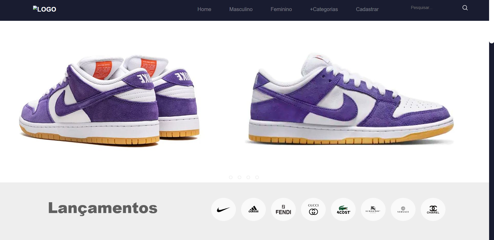
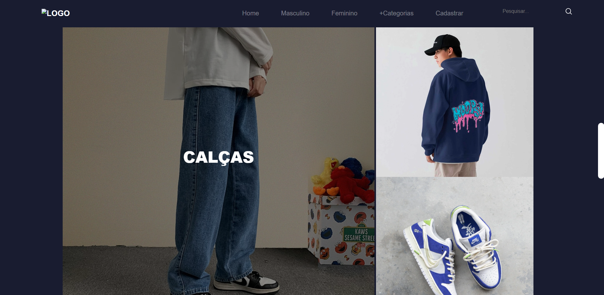

# Loja-de-Roupas

Projeto: Site de Loja de Roupas
Este projeto é um site fictício de uma loja de roupas, desenvolvido com HTML, CSS e um pouco de JavaScript, ideal para explorar conceitos de design e funcionalidade em sites de comércio eletrônico.

Funcionalidades:
Design responsivo que se adapta a diferentes dispositivos (mobile, tablet e desktop).
Menu de navegação interativo, com JavaScript para melhorar a experiência do usuário.
Galeria de produtos, com imagens estilizadas e informações básicas.
Botões dinâmicos, como "Adicionar ao carrinho", com efeitos visuais e interatividade.
Uso de animações CSS para transições suaves e destaque visual.
Objetivo do projeto:
Praticar e aplicar conhecimentos de front-end, como:

Estruturação semântica com HTML.
Estilização responsiva e moderna com CSS.
Introdução ao uso de JavaScript para funcionalidade básica.
Este projeto é uma introdução prática à criação de sites de comércio eletrônico, unindo design atrativo e interatividade funcional.
